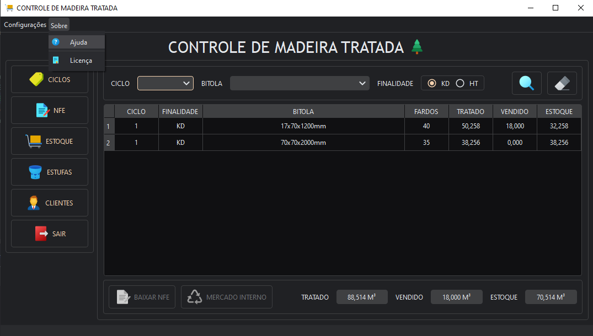
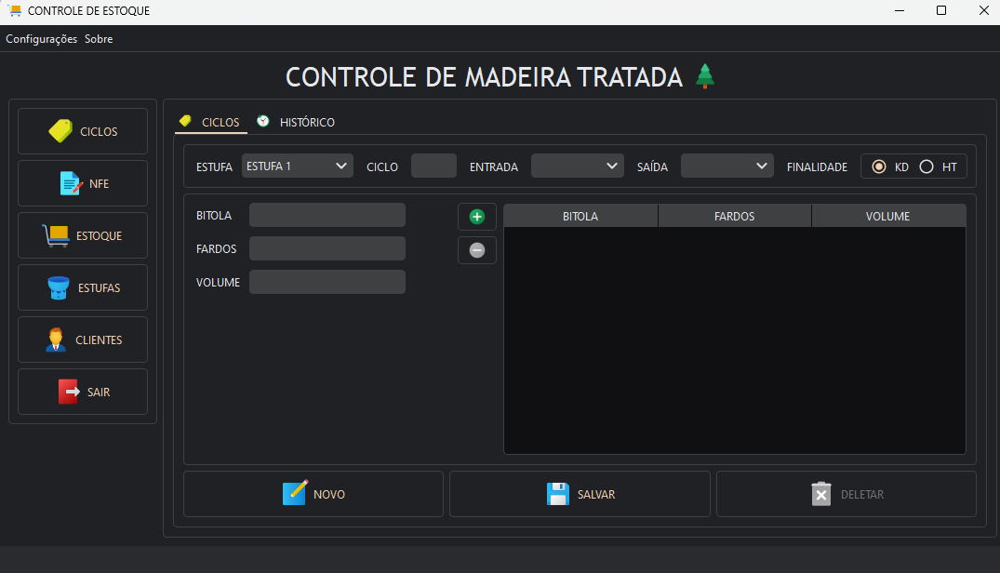
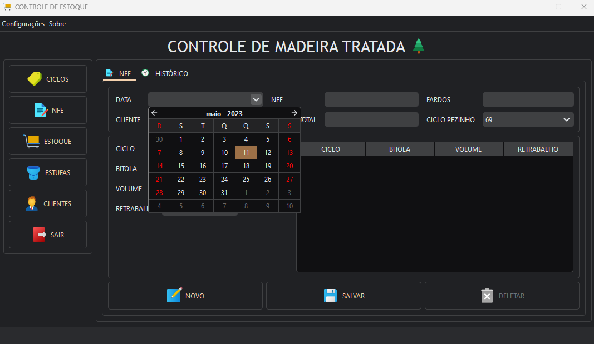
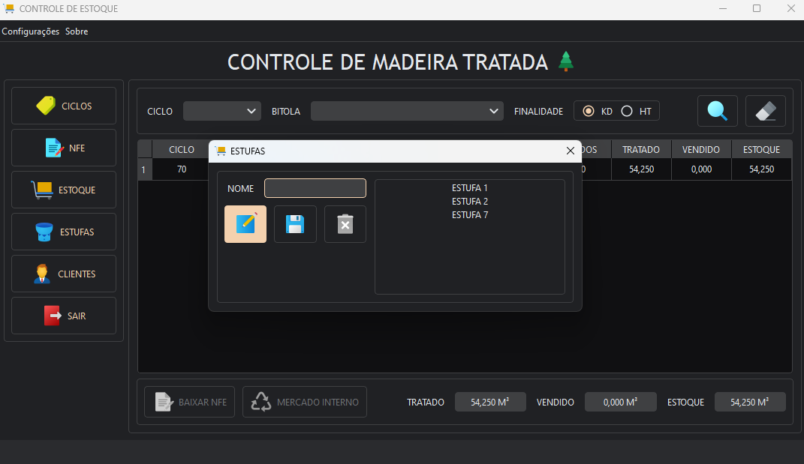
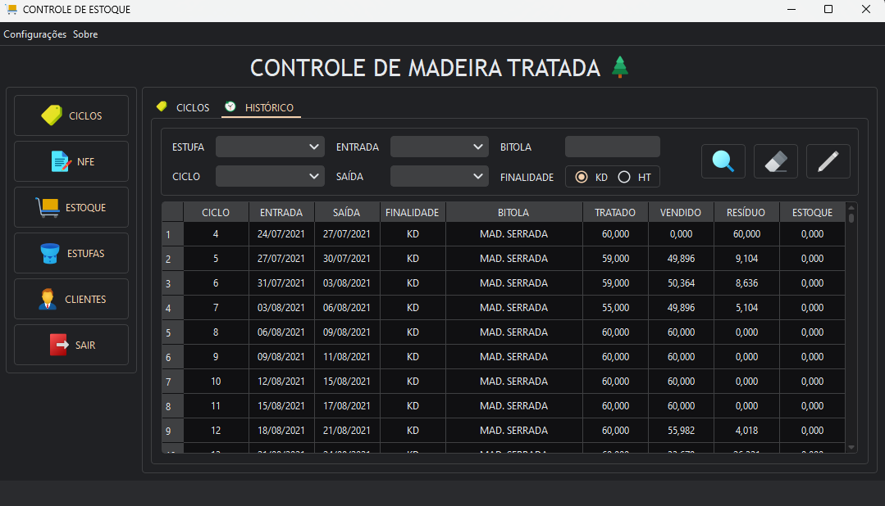
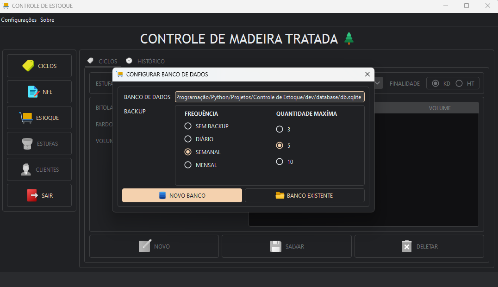
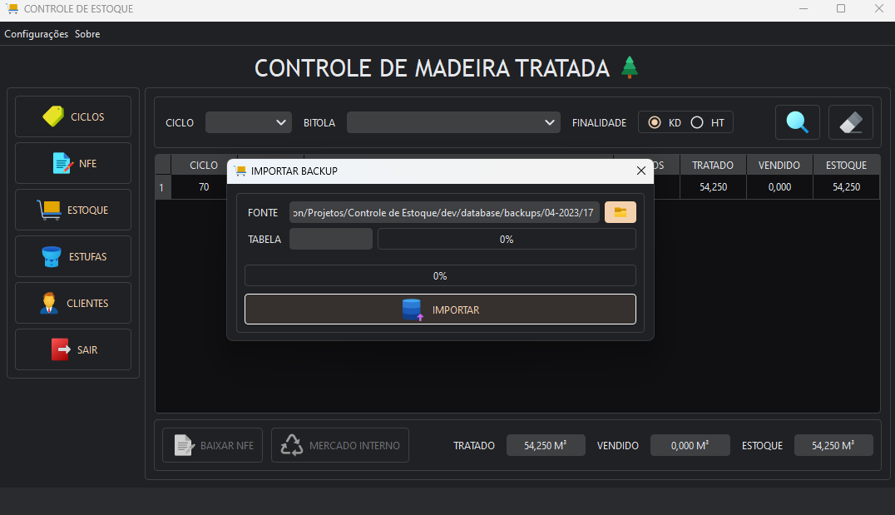

# Controle de Estoque de Madeira Tratada

Aplicação feita exclusivamente para uso interno de uma empresa na qual fiz parte.

Aplicativo para controle de estoque de madeira tratada seguindo lógica interna da empresa, banco de dados
compartilhado na rede com possibilidade de acesso simultâneo, sistema de backup automático, dark / light mode e mais!

Para baixar a versão de distribuição
clique [aqui](https://github.com/Paulo1402/Controle-de-Estoque/releases/download/v1.0.0/installer.exe). (Apenas para
Windows).

Com o aplicativo aberto, basta clicar em _Sobre/Ajuda_ no menu superior para abrir um rápido overview no navegador.

## 🖼️ Imagens

---

## Requisitos para desenvolvimento:

- Python (Foi usado a versão 3.11, mas muito provavelmente deve funcionar em outra versão próxima).
- Baixar ou clonar o repositório.
- Com a pasta do repositório aberta no terminal rode o comando `pip install ./dev/requirements.txt` para instalar as
  dependências (De preferência com um virtual environment ativo).
- Rodar o script de entrada usando `python ./src/main.py`.

## 🛠 Tecnologias e Libs

- Python
- PySide6
- PyQtDarkTheme
- AutoPyToExe
- sqlite

#### Icons8 - https://icons8.com.br
