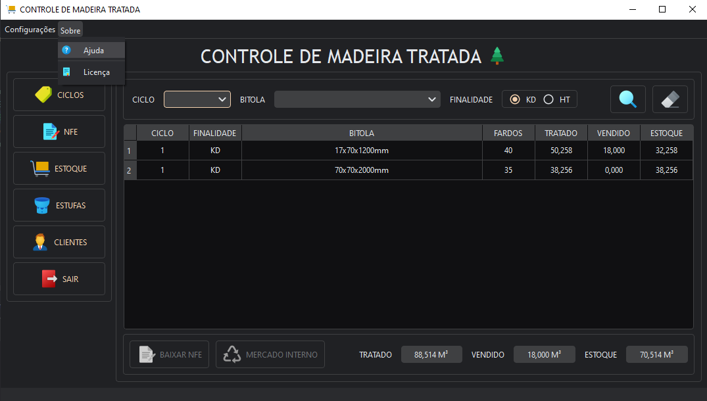

# Controle de Estoque de Madeira Tratada

Para baixar a versão de distribuição clique [aqui](https://github.com/Paulo1402/Controle-de-Estoque/releases/download/v1.0.0/installer.exe). (Apenas para Windows).

Com o aplicativo aberto, basta clicar em _Sobre/Ajuda_ no menu superior para abrir um rápido overview no navegador.

---

## Requisitos para desenvolvimento:

- Python (Foi usado a versão 3.11, mas muito provavelmente deve funcionar em outra versão próxima).
- Baixar ou clonar o repositório.
- Com a pasta do repositório aberta no terminal rode o comando `pip install ./dev/requirements.txt` para instalar as
  dependências (De preferência com um virtual environment ativo).
- Rodar o script de entrada usando `python ./src/main.py`.
